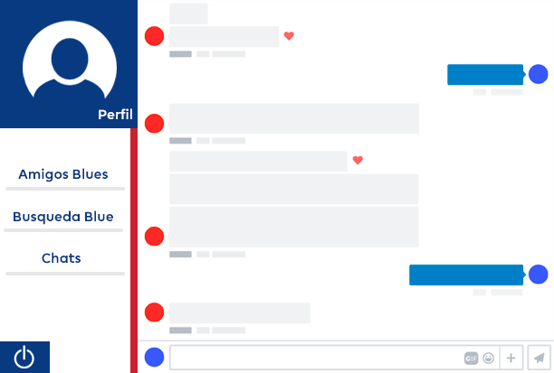
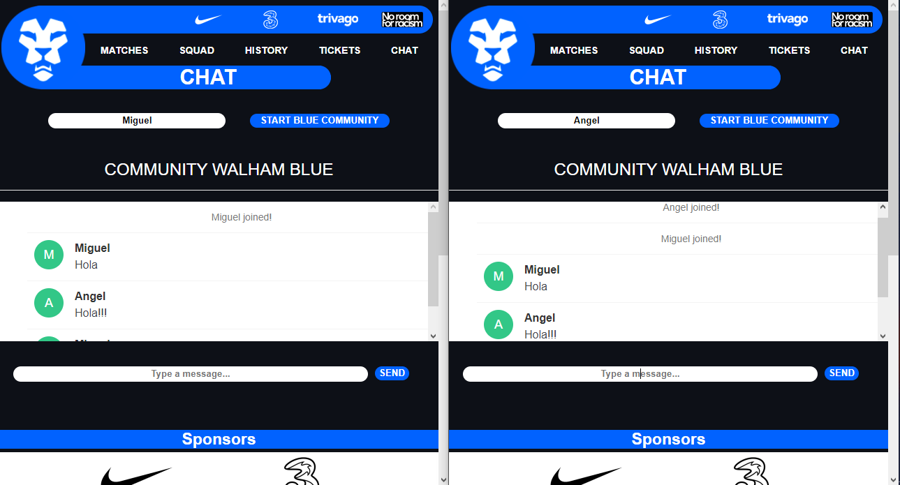
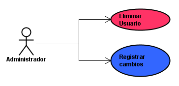
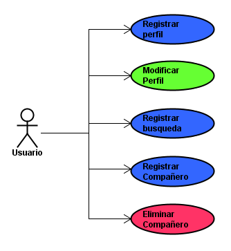

# :one::nine:WALHAM BLUE:zero::five:

## Walham Blue Community - HeokuApp

### Miguel Ángel Rodríguez Siachoque:black_nib:

## :one::soccer:Resumen
  El nombre ___Walham Blue___ proviene de una combinación entre el estadio ___Stamford Bridge___ afiliado al ___Chelsea Football Club___ y ___Walham Green___ el distrito donde se encuentra dicho estadio.
  
  Este es un proyecto enfocado para la ayuda de aficionados e hinchas del futbol, especialmente diseñado para aquellos hinchas de ___Chelsea Football Club___. Puesto que se encontraran con herramientas para el conocimiento de su equipo, por ejemplo conocer su historia, jugadores, estadio, palmares, etc..
  
## :two::soccer:Descripción
  La herramienta en la que se enfoca este proyecto es ___Walham Blue___, cuya función se encargará de conocer personas para las siguientes funciones:
  >:large_blue_circle: Búsqueda de personas para asistir a un partido en compañía.
### :arrow_forward:Proceso
  Teniendo en cuenta las funcionalidades se explicará el proceso de ___Walham Blue___:
  >1. Ingresar a ___Walham Blue___.
  >2. Registrarse y aceptar términos y condiciones.
  >3. Se podrá visualizar la opcion de ___Búsqueda Blue___ con el cual se hará un match para encontrar compañeros que deseen asistir al partido en compañía.
  >4. Cuando ___Búsqueda Blue___ encuentre una persona, lo enlazará a un chat para poder contactarse.
  >5. En cuanto se converse con dicha persona, se notificará si desea o no asistir al partido con esa persona.
  >6. En dicho caso que no se pueda hablar con la persona en el momento, se almacenara el chat en la opción ___Chats___.
  
  >:warning:El chat se realiza con el fin de conocer la persona con la que asistirá  y verificar datos, así poder generar un buen entorno en ___Walham Blue___.

### :arrow_forward:Opciones
  

### :arrow_forward:Chat
  Chat final y funcional.
  

  Las opciones que se presentarán una vez hagan parte de la comunidad de ___Walham Blue___ son:
  >- **Name:** Ingresar nombre de usuario.
  >- **Start Blue Community:** Registrar nombre de usuario. 
  >- **Type a message...:** Escribir el mensaje a enviar.
  >- **Send:** Enviar mensaje del usuario.

## :three::soccer:Historias De Usuario
### :arrow_forward:Historias de Usuario 1 - Administrador

1. #### Eliminar Usuario
> **Como** Administrador, **Quiero poder** eliminar un usuario, **Para** eliminar un usuario que interfiera con la actividad social de Walham Blue.
> ##### Criterios de Aceptación
>   - Si un usuario incumple con alguno de los términos y condiciones, será eliminado.
2. #### Registrar cambios
> **Como** Administrador, **Quiero poder** realizar cambios en Walham Blue, **Para** mejorar la interacción y solución de errores en Walham Blue.
> ##### Criterios de Aceptación
>   - Si se presenta algún error en Walham Blue, como no poder acceder o errores en el match, entonces se revisará y modificará para solucionar dichos problemas.
>   - Si se desea realizar alguna modificación visual, para ayudar al usuario a entender mejor el entorno.

### :arrow_forward:Historias de Usuario 1 - Usuario

1. #### Registrar perfil
> **Como** Usuario, **Quiero poder** registrar mi perfil en Walham Blue, **Para** empezar a interactuar con las funciones de Walham Blue.
> ##### Criterios de Aceptación
>  - No puede haber dos nickname.
2. #### Modificar perfil
> **Como** Usuario, **Quiero poder** modificar mi perfil ya creado en Walham Blue, **Para** poder renovar mis datos en caso de algún cambio en ellos.
> ##### Criterios de Aceptación
>   - El usuario no puede modificar su nickname.
>   - El usuario puede modificar sus datos, siempre y cuando otro usuario no tenga esos mismos datos.
3. #### Registrar búsqueda
> **Como** Usuario, **Quiero poder** realizar una búsqueda de un compañero, **Para** poder encontrar un asistente para ver un partido.
> ##### Criterios de Aceptación
>   - El usuario debe registrar a que partido quiere asistir.
4. #### Registrar compañeros
> **Como** Usuario, **Quiero poder** registrar un compañero asistente en Walham Blue, **Para** mejorar la interacción y solución de errores en Walham Blue.
> ##### Criterios de Aceptación
>   - El usuario debe registrar el nombre del usuario, para poder agregarlo.
5. #### Eliminar compañeros
> **Como** Usuario, **Quiero poder** eliminar un compañero asistente en Walham Blue, **Para** mejorar y administrar mejor la lista de usuarios preferidos para asistir.
> ##### Criterios de Aceptación
>   - El usuario debe registrar el nombre del usuario, para poder eliminarlo.